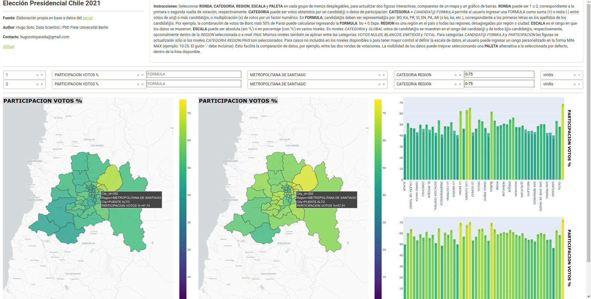

# Chile-Elections

This data science project showcases in an interactive Dashboard Application the outcome of the two 
voting rounds of the 2021 Chilean Presidential Elections.

Voting data was obtained from https://www.servelelecciones.cl/ and compiled into 
datasets in the files `app/data/votes_*.csv`.


# Building Dashboard Application for visualizing voting results.

This Dashboard Application allows users to visualize the voting outcome in two types of interactive figures:
a Mapbox choropleth map and a Bar chart.
These figures display geospatial information of the voting data, based on various options customizable by 
the user, such as the round of voting, candidate, region, color palette and range over which data will be 
shown.

The Dashboard Application (see directory `app/`) is built in **Plotly Dash**, which uses **Flask** as a web framework.
However, as **Flask's** built-in server does not scale well and by default serves only one request at a time, 
hence it is not suitable for production.
To deploy the Dashboard, consequently, we instead use **Nginx** for reverse proxying to handle the http requests.
The incoming traffic is forwarded by **Nginx** to **Gunicorn**, which in turn handles the python code containing the
Dashboard Application. 

The figure below displays the Dashboard Application layout when comparing participation data for both voting rounds, 
disaggregated by cities in the Santiago Metropolitan Region.
Data is shown in a custom common scale in the range of 0-75%.



## Dashboard instructions (translated from Spanish version shown in Dashboard)

Select **RONDA**, **CATEGORIA**, **REGION**, **ESCALA** and **PALETA** from each group of dropdown menus,
to update two interactive figures, each consisting of a map and a bar chart.
**RONDA** (round) can be 1 or 2, corresponding to the first or second round of voting, respectively.
**CATEGORIA** (category) can be the votes obtained by a candidate or participation data.
**CATEGORIA = ** *CANDIDAT@ FORMULA* allows the user to enter a FORMULA as the sum (+) or subtraction (-)
between the votes of one or more candidates, or the product (x) of the votes by a numerical factor. 
In **FORMULA**, candidates must be represented by: 
BO, KA, PR, SI, EN, PA, AR (or bo, ka, etc.), corresponding to the first letters of each candidate's surname.
For example, the combination of Boric's votes plus 50% of Parisi's votes can be calculated by entering the 
**FORMULA**: bo + 0.5xpa.
**REGION** is one of the country's regions or all the regions, disaggregated by region or city.
**ESCALA** (scale) is the range over which the data is displayed.
**ESCALA** can be absolute (without %) or in percentage (with %) at various levels.
The *CATEGORIA* and *GLOBAL* levels show the votes of the candidates in the candidate's and all
candidates' range, respectively, optionally within the selected *REGION* or at national level (*PAIS*).
The same levels also apply between categories of *VOTOS NULOS*, *BLANCOS*, *EMITIDOS* and *TOTAL*.
For categories *CANDIDAT@ FORMULA* and *PARTICIPACION* (participation) the figures wil only be updated 
when the levels *CATEGORIA REGION/PAIS* are selected.
For cases not included in the available levels or to have more control when defining the data scale,
the user can enter a custom range in the format 'MIN-MAX' (example: 10-25. Where hyphen must be included).
This facilitates the comparison of data, for instance, between the two rounds of voting.
The visibility of the data can be improved by selecting an alternative colour palette (**PALETA**) to the 
default one from the available list. 

# Deploying Web Application to Google Cloud Platform (Artifact Registry, Compute Engine)

## Containerizing Dashboard Application:

We will deploy our Dashboard Application to the **Google Cloud Platform (GCP)**.
For this, we start by building a **Docker** image of our Dashboard Application, based on the intructions 
contained in a Dockerfile.
In our case, the Dockerfile is stored in the root directory of our git repository, 
from where we can run the following command:

```
docker build -t chile-elections:1.0 -f deploy/Dockerfile .
```

If the image was created, it should appear in the listed shown after running:

```
docker images
```

We can now create the **Docker** container associated to our image by running:

```
docker run --network="host" -d chile-elections:1.0
```

Here we added the "host" network option so that the the host (our local machine) network is 
accessible to the container.
If the container was correctly initialized, the **Gunicorn** server should be also running.
We can check this from the container logs:

```
docker logs <container_id>
```

And we should be able to see our Dashboard Application by openning a browser at http://127.0.0.1 
or its alias http://localhost.

## Pushing Docker image to Google Cloud Artifact Registry:

Once we checked that our Dashboard Application can be accessed from our local machine,
it's now time to deploy it to the GCP. 
First, we create a repository in the GC **Artifact Registry**, where our **Docker** image will be stored.

```
gcloud artifacts repositories create chile-elections \
    --repository-format=docker \
    --location=us-east1 \
    --description="docker repo"
```

We can confirm that the repository has been created by running the following command:

```
gcloud artifacts repositories list
```

Before we can push or pull our **Docker** image, we need to configure **Docker** to use the 
GC **Command Line Interface** (CLI) to authenticate requests to the **Artifact Registry**.

```
gcloud auth configure-docker us-east1-docker.pkg.dev
```

We now tag the **Docker** image with our repository in **Artifact Registry**. 
This configures the docker push command to push the image to the specified location.

```
docker tag chile-elections:1.0 us-east1-docker.pkg.dev/<gc_project_id>/chile-elections/chile-elections
```

We can now push the image to our **Artifact Registry**.

```
docker push us-east1-docker.pkg.dev/<gc_project_id>/chile-elections/chile-elections
```

## Deploying Docker container to Google Cloud Compute Engine:

We will now deploy the **Docker** image stored in our **Artifact Registry** as a **Docker** container into
a virtual machine (VM), which we will create using the GC **Compute Engine** service.
Before creating the VM, we need to configure a firewall rule to allowing incoming http traffic 
to our VM instance.

```
gcloud compute firewall-rules create chile-elections-firewall-rules \
    --target-tags=chile-elections-firewall \
    --network=default \
    --direction=ingress \
    --action=allow \
    --rules=tcp:22,tcp:80,tcp:8080,tcp:443 \
    --source-ranges=0.0.0.0/0
```

Once the firewall has been configured, we can deploy our docker container into a VM instance.
We can do this by creating an instance template that includes the configuration of our firewall, 
the docker image containing the Dashboard Application and the VM instance we want to create. 

```
gcloud compute instance-templates create-with-container chile-elections-instance-template \
    --tags=chile-elections-firewall \
    --container-image=us-east1-docker.pkg.dev/<gc_project_id>/chile-elections/chile-elections \
    --machine-type=e2-micro 
```

Then, we use this instance template to create our VM instance in the desired zone.

```
gcloud compute instances create chile-elections-instance \
    --source-instance-template=chile-elections-instance-template \
    --zone=us-east1-b 
```

To check if our docker container has been correctly initialized and is up and running, we can access
our VM instance using `SSH` protocol and our key credentials as shown below.
Once we log into the VM, we can run any `docker` command, such as `docker ps`, to examine the status 
of our docker container.

```
gcloud compute ssh chile-elections-instance --ssh-key-file ~/.ssh/gc_compute_engine
```

Where `~/.ssh/gc_compute_engine` needs to be replace by the appropriate `<key_file_path>`.

After confirming that the docker container is working properly, we will be able to inspect our 
Dashboard Application by openning a browser under the Public DNS URL provided 
for our VM instance.

In this case, the Dashboard Application is accessible under the following URL:
http://34.138.147.106